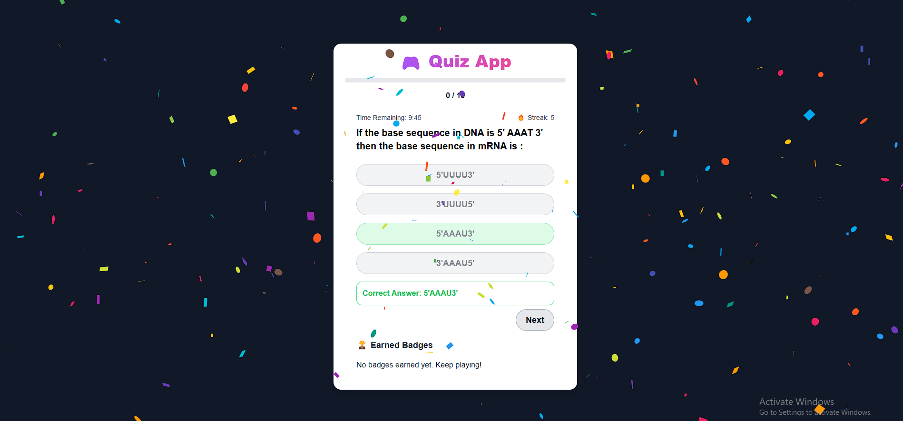
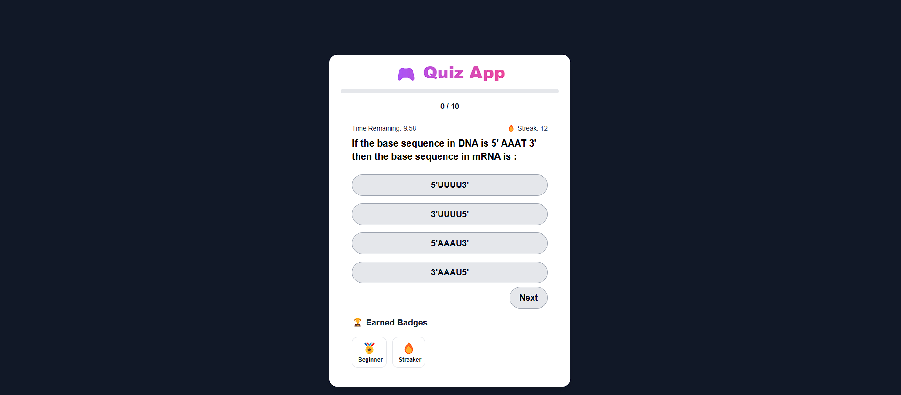

# Quiz Application

This project is a web-based quiz application with gamification features, built using Nextjs and styled with Tailwind CSS. It fetches quiz data from a provided API endpoint and presents it through an intuitive and engaging user interface.

## Project Overview

This application presents users with multiple-choice questions fetched from the API: `https://api.jsonserve.com/Uw5CrX`. Users select their answers, and upon completion of the quiz, a summary of their results, including the total score, is displayed. The application incorporates several gamification elements to enhance user engagement.

## Features

- **Start Quiz:** Begins the quiz experience.
- **Multiple-Choice Questions:** Presents questions with multiple answer options.
- **Quiz Summary:** Displays the final score upon quiz completion.
- **Gamification:**
  - **Progress Bar:** Visually indicates the user's progress through the quiz.
  - **Animated Score Display:** Provides visual feedback when the user scores points.
  - **Immediate Answer Feedback:** Shows whether the selected answer is correct or incorrect.
  - **Timer:** Adds a time limit for each question, increasing the challenge.
  - **Streak Counter:** Tracks the user's consecutive correct answers, rewarding consistency.
  - **Badges:** Awards virtual badges for achieving specific milestones.

## Badges

The application features a badge system to reward users for their achievements. Badges are awarded based on specific criteria, as detailed below:

| Badge       | Description                             | Criteria                        | Icon |
| ----------- | --------------------------------------- | ------------------------------- | ---- |
| Beginner    | Answer 5 questions.                     | Answer 5 questions.             | 🏅   |
| Quiz Master | Get 10 correct answers in a row.        | 10 correct answers in a row.    | 🏆   |
| Night Owl   | Play at midnight.                       | Play between midnight and 5 AM. | 🌙   |
| Streaker    | Answer 10 questions correctly in a row. | 10 correct answers in a row.    | 🔥   |

## Technologies Used

- **Next.js:** React framework for server-side rendering and static site generation.
- **React:** JavaScript library for building user interfaces.
- **Tailwind CSS:** Utility-first CSS framework for rapid UI development.
- **Axios:** For making HTTP requests to the API.
- **Zustand:** A small, fast and extensible bearbones state-management solution using simplified flux or atomic updates.

## Setup Instructions

1.  **Clone the Repository:**

    ```bash
    git clone (https://github.com/Sakshi4480/Internship-Assignment.git)
    cd quiz-app
    ```

2.  **Install Dependencies:**

    ```bash
    npm install
    ```

3.  **Start the Development Server:**

    ```bash
    npm run dev
    ```

    This will start the development server and open the application in your browser.

## Implementation Details

This section provides a brief overview of how the new features were implemented.

### Timer

A timer was implemented using React's `useState` and `useEffect` hooks. The timer starts when a question is displayed and counts down. If the time runs out, the answer is considered incorrect.

### Streak Counter

The streak counter is maintained using a state variable that increments when the user answers correctly and resets to zero when they answer incorrectly.

### Badges

Badges are managed using the `badgeCriteria` object (defined in `src/badgeCriteria.js`), which defines the criteria for each badge. The application checks these criteria during gameplay and awards badges accordingly. The awarded badges are then displayed on the results screen.

## Live Demo

(https://internship-assignment-kappa.vercel.app/)

## Screenshots

- Screenshot 1: Quiz Interface
  
- Screenshot 2: Question and Answer (Correct)
  
- Screenshot 3: Question and Answer (Incorrect)
  
- Screenshot 4: Quiz Screen with Badges
  
- Screenshot 5: Results Screen with score
  

## Video Walkthrough

<a href="https://drive.google.com/file/d/1xzcv5XOBm_cGyZDk-vdHTl0-JIw-an3a/view?usp=sharing" target="_blank">Video Walkthrough</a>
#
